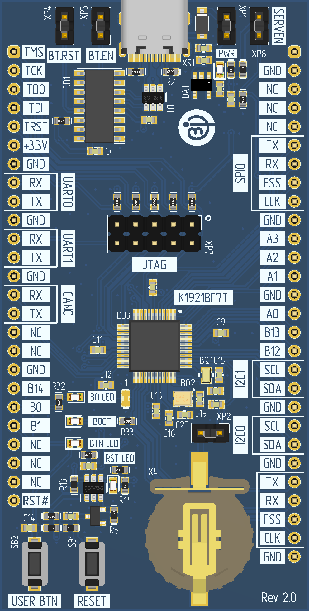
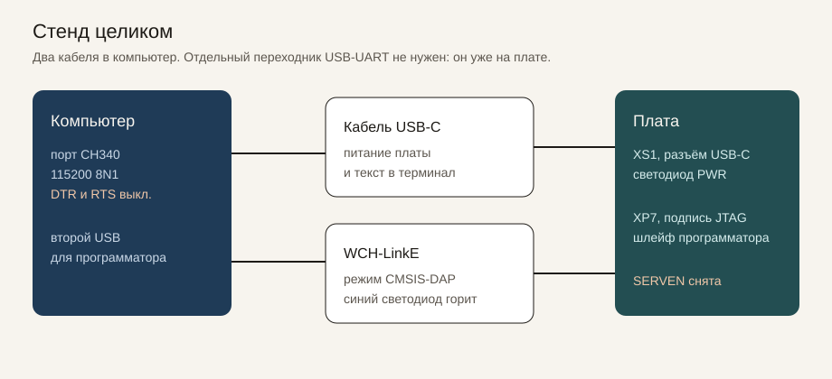
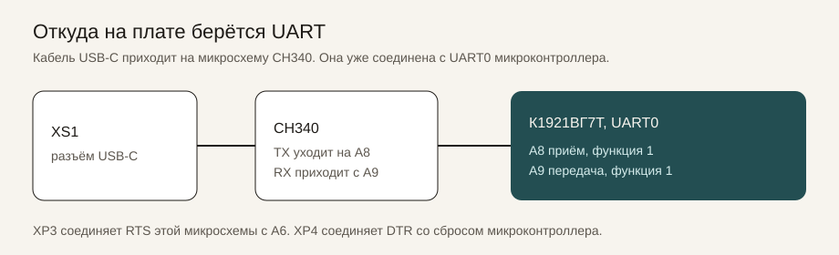
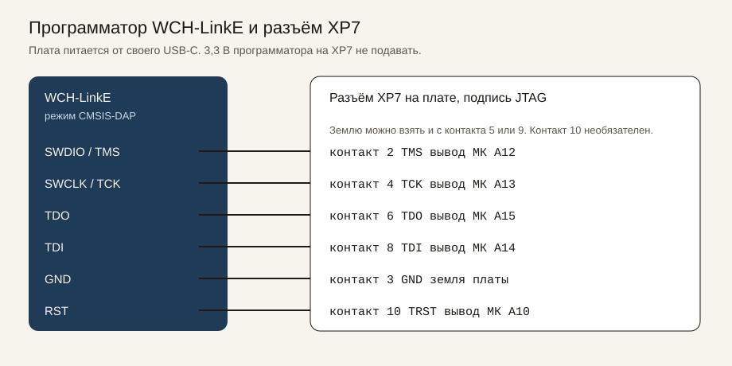
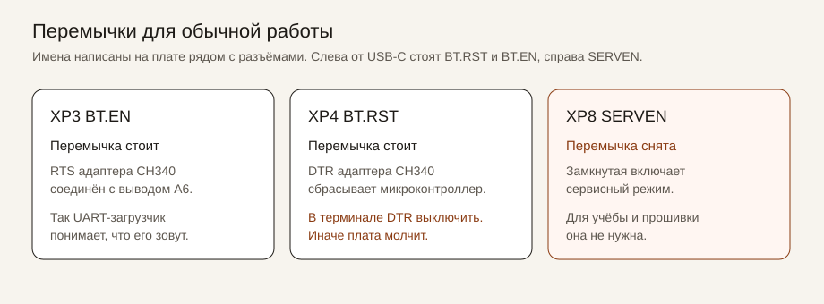
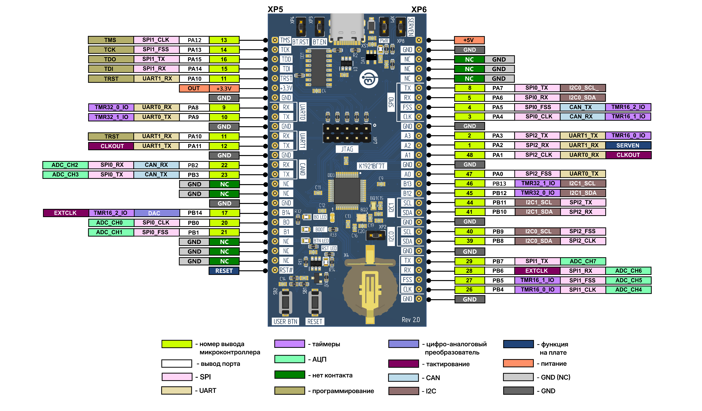

# К1921ВГ7Т. Учебный проект

Прошивка платы **NIIET-MINI-K1921VG7T** (КФДЛ.441461.043 rev 2.0), микроконтроллер **К1921ВГ7Т**.
Сборка, запись и проверка на плате сделаны на **Windows 10** и **Windows 11**. После прошивки UART печатает отчёт, светодиод B0 мигает раз в секунду, левая кнопка USER BTN печатает время.

Автор: [Дмитрий](https://github.com/mamkincoderr) · [Telegram](https://t.me/oDeXteRo)

Команды ниже запускать из корня проекта, рядом с `CMakeLists.txt`.

## Что поставить

- **Windows 10 или Windows 11.**

- **MounRiver Studio 1.92** — исходники, сборка, запись и отладчик.

  <details>
  <summary>Где взять</summary>

  Дистрибутив: [mounriver.com/download](http://www.mounriver.com/download). Установить Studio **1.9.x (ветка 1.92)**.

  File → Import → General → Existing Projects into Workspace. Каталог — корень этого репозитория, проект `K1921VG7T_Cmake`.

  Молоток вызывает `build.bat`. Без аргументов это сборка (`all`). Остальные цели: `flash`, `boot-flash`, `uart`, `clean`. Отладка: Run → Debug Configurations → **K1921VG7T_Cmake**, ELF `obj\K1921VG7T_Cmake.elf`. Описание регистров: `svd\K1921VG7T.svd`.

  Компилятор Studio для этой платы не используется. Сборка берёт GCC НИИЭТ 12.2.1 из архива ниже.
  </details>

- **Архив инструментов** `pack\k1921vg7t-tools.7z`. Внутри GCC НИИЭТ 12.2.1 и OpenOCD. Пока архив не распакован, сборка не запустится.

  <details>
  <summary>Как распаковать</summary>

  Открыть архив в 7-Zip и извлечь **в папку `tools`** — туда, где уже лежат `run.ps1` и `uart_flash.py`. Путь назначения: `...\K1921VG7T_Cmake\tools`. Лишнюю вложенную папку не создавать: рядом с `CMakeLists.txt` не должны появиться `gcc` и `openocd`.

  После распаковки на месте:

  | Путь | Что это |
  |---|---|
  | `tools\gcc\bin\riscv64-unknown-elf-gcc.exe` | компилятор 12.2.1 |
  | `tools\openocd\bin\openocd.exe` | запись и отладка |

  7-Zip может спросить замену `run.ps1`, `fetch.ps1` и `uart_flash.py`. Заменить: в архиве те же скрипты, что уже лежат в репозитории. Тот же шаг записан в начале `user\main.c`.

  Архив один, около 50 МБ. Распакованные инструменты занимают около 600 МБ. `tools\fetch.ps1` — запасной путь: заново скачать те же GCC и OpenOCD с публичного GitFlic, если архива нет под рукой.
  </details>

- **7-Zip.** Проводник Windows файл `.7z` не открывает.

  <details>
  <summary>Установка из PowerShell</summary>

  ```powershell
  winget install --id 7zip.7zip --exact
  ```
  </details>

- **CMake** версии 3.20 или новее.

  <details>
  <summary>Установка из PowerShell</summary>

  ```powershell
  winget install --id Kitware.CMake --exact
  ```

  Проверка: `cmake --version`. `build.bat` ищет `cmake.exe` в стандартных каталогах и без перезапуска Studio.
  </details>

- **Ninja.**

  <details>
  <summary>Установка из PowerShell</summary>

  ```powershell
  winget install --id Ninja-build.Ninja --exact
  ```

  Проверка: `ninja --version`.
  </details>

- **Python** с пакетом pyserial. Нужен только для записи через USB, цель `uart`.

  <details>
  <summary>Установка</summary>

  ```powershell
  py -m pip install pyserial
  ```

  Python из `tools\gcc` не подходит: в нём нет pyserial. На время записи порт COM должен быть свободен.
  </details>

## Собрать

```powershell
powershell -NoProfile -ExecutionPolicy Bypass -File .\tools\run.ps1 build
```

В Studio то же делает молоток (Ctrl+B). Новый файл `.c` в папке `user\` подхватывается сам. В конце сборки печатается карта Flash.

| Файл | Куда пишется |
|---|---|
| `obj\bootloader\bootloader.elf` | `0x0000`–`0x1FFF`, 8 КБ |
| `obj\K1921VG7T_Cmake.elf` | с адреса `0x2000` |

## Прошить

Загрузчик пишется один раз и ещё раз после полного стирания Flash. Приложение пишется отдельно. Полное стирание само по себе не запускать.

```powershell
powershell -NoProfile -ExecutionPolicy Bypass -File .\tools\run.ps1 boot-flash
powershell -NoProfile -ExecutionPolicy Bypass -File .\tools\run.ps1 flash
```

`flash` сверяет запись и пускает кристалл. В Studio те же цели: `boot-flash` и `flash`. Запись только по USB, без программатора: цель `uart`.

<details>
<summary>Плата и подключение</summary>



Рисунок из документации АО «НИИЭТ», [плата КФДЛ.441461.043](https://gitflic.ru/project/niiet_hardware/441461_043).



Кабель USB-C в разъём XS1: питание и порт CH340. Второй USB — в WCH-LinkE, шлейф в XP7. Отдельный переходник USB-UART не нужен.



Терминал: порт CH340 из «Порты (COM и LPT)», **115200 8N1**, **DTR и RTS выключены**. При включённом DTR и надетой XP4 микроконтроллер сидит в сбросе и молчит.

| На плате | Куда | Зачем |
|---|---|---|
| XS1 USB-C | верх | питание и UART |
| XP7 JTAG | середина | программатор |
| XP3 BT.EN | слева от USB | стоит. RTS CH340 на A6 |
| XP4 BT.RST | слева от USB | стоит. DTR CH340 на сброс |
| XP8 SERVEN | справа | снята |
| B0 LED | у микросхемы | вывод B0, горит при 1 |
| USER BTN, SB2 | левая кнопка | вывод B1, при нажатии 0, печатает время |
| RESET, SB1 | правая кнопка | аппаратный сброс, время не печатает |
| PWR | справа сверху | плата запитана |

</details>

<details>
<summary>Программатор WCH-LinkE</summary>

Один раз перевести адаптер в CMSIS-DAP: зажать ModeS и вставить в USB. Синий светодиод горит, в диспетчере устройств `VID_1A86&PID_8012`.

3,3 В программатора на XP7 не подавать: плата питается от своего USB-C. Контакта nRESET на XP7 нет. Земля обязательна.



| WCH-LinkE | XP7 | Вывод МК |
|---|---|---|
| SWDIO / TMS | 2 | A12 |
| SWCLK / TCK | 4 | A13 |
| TDO | 6 | A15 |
| TDI | 8 | A14 |
| GND | 3, 5 или 9 | земля |
| RST | 10 | A10, можно не подключать |

A12 и A13 заняты JTAG. Светодиод и кнопка висят на B0 и B1.

</details>

<details>
<summary>Перемычки</summary>



XP3 и XP4 стоят. XP8 (SERVEN) снята. В терминале DTR и RTS выключены.

</details>

<details>
<summary>Распиновка примера</summary>



| Функция | Вывод |
|---|---|
| Светодиод B0 LED, горит при 1 | B0 |
| Кнопка USER BTN, ноль при нажатии | B1 |
| UART0 приём / передача, функция 1 | A8 / A9 |
| Вход в загрузчик через XP3 | A6 |
| Сброс от DTR через XP4 | цепь BT.RST |

Полная таблица проводов: [docs/WIRING.md](docs/WIRING.md).

</details>

<details>
<summary>Что должно появиться в UART</summary>

Числа АЦП на другой плате будут другими. Слова `ok` должны остаться. `osc 0` значит, что флаг генератора часов не взведён, секунды при этом идут. Коды АЦП сняты с открытых входов и не являются напряжением.

```text
K1921VG7T, SYSCLK = 100 MHz
ADC 22 4095 1275 386 1159 ok
CRC a6d17ede ok
RTC osc 0 gpr ok
time 2026-10-04 00:00:09
DAC 2048
WDT load ok lock ok
SIU id 04e4c402 rev 2 serv 0
TMR32 0 -> 4900 runs
B1 prints time. LED B0 blinks 1 Hz
```

Дальше B0 LED мигает: 0,5 с горит, 0,5 с нет. Левая кнопка USER BTN печатает `time ГГГГ-ММ-ДД чч:мм:сс`.

</details>

<details>
<summary>Если молчит или не собирается</summary>

- Нет `tools\gcc`: архив `pack\k1921vg7t-tools.7z` не распакован в папку `tools`.
- PWR не горит: нет питания по USB-C.
- SERVEN стоит: снять.
- DTR включён при надетой XP4: микроконтроллер в сбросе.
- Открыт порт программатора, а не CH340. Скорость 115200.
- Нажата правая RESET, а не левая USER BTN.
- Для JTAG шлейф в XP7, адаптер в режиме CMSIS-DAP, земля соединена.

Повторный пуск уже записанной программы: кнопка RESET или `python .\tools\uart_flash.py --reset`.

</details>

<details>
<summary>Память, ограничения, состав</summary>

| Область | Адрес | Размер |
|---|---|---|
| Загрузчик | `0x0000` | 8 КБ |
| Приложение | `0x2000` | остальной Flash, всего 512 КБ |
| ОЗУ | `0x20000000` | 32 КБ |

Кварц 16 МГц, ядро в примере около 100 МГц. Миллисекундная задержка идёт от системного таймера `0xE0000000`. Отдельных блоков CRC, HASH и CRYPTO на кристалле нет: контрольная сумма считается программой. Часы хранят секунды, календарь считается из них.

SERVEN не ставить. Не вызывать `RCU->RSTSYS` и процедуру OpenOCD `k1921vg7t_sw_reset`: после серии таких сбросов контроллер Flash зависал. После прошивки кристалл пускает `k1921_run`. Частота JTAG в проекте 100 кГц. Сторожевому таймеру бит сброса в примере не включать.

| Папка | Содержимое |
|---|---|
| `user\` | пример |
| `sdk\ll\` | функции блоков, один каталог заголовков |
| `sdk\source\` | старт и такт |
| `bootloader\` | вторая программа, UART-загрузчик |
| `pack\` | архив GCC и OpenOCD |
| `docs\` | рисунки платы |

Комментарии в коде русские. Строки UART на латинице. Журнал проверки на плате: [docs/СОСТОЯНИЕ.md](docs/СОСТОЯНИЕ.md).

Заголовки регистров, загрузчик и библиотека блоков взяты из материалов АО «НИИЭТ» и лежат здесь для изучения этого микроконтроллера.

</details>
